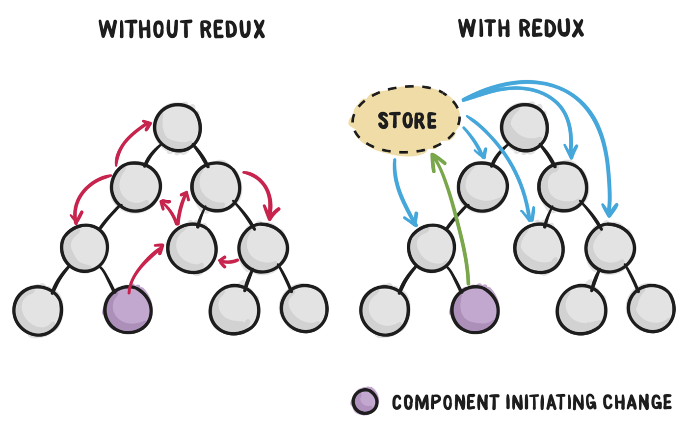

# [Tutorial] React Redux Persist

## Redux architecture

Redux is a predictable state container for JavaScript apps. It solves the problem of sharing states between components, making it unidirectional. `It works as a global variable`.



The whole global state of your app is stored in an object tree inside a single `store`. The only way to change the state tree is to create an `action`, an object describing what happened, and dispatch it to the store. To specify how state gets updated in response to an action, you write pure `reducer` functions that calculate a new state based on the old state and the action.


Redux-persist saves the states, using localstorage, being able to refresh our application and not lose the data on the screen.

## 1. Create a React App

First of all, we need create a react project:

```
npx create-react-app react-redux-example
```

## 2. Install necessary dependencies

Now, with the project created, inside the projecc folder, run this commands to add the necessary dependencies:

```bash
npm install --save-dev redux react-redux redux-devtools-extension redux-persist
```

Or

```bash
yarn add --dev redux react-redux redux-devtools-extension redux-persist
```

## 3. Adapt the project folder tree

```css
src
 |- components
 |- redux
 |  |- blackReducer
 |  |  |- reducer.js
 |  |  '- types.js
 |  |- blackReducer
 |  |  |- reducer.js
 |  |  '- types.js
 |  |- rootReducer.js
 |  '- store.js
 |- views
    '- App
       '- App.js
```

## 4. Set up

### App.js

```js
import React from 'react';
import { Provider as ReduxProvider } from 'react-redux';
import { PersistGate } from 'redux-persist/integration/react';
import { store, persistor } from '../../redux/store';

const App = () => {
  return (
    <ReduxProvider store={store}>
      <PersistGate loading={null} persistor={persistor}>
        {...}
      </PersistGate>
    </ReduxProvider>
  );
};
export default App;
```

### blackReducer / types.js

```js
export const ADD_BLACK_VALUE = 'ADD_BLACK_VALUE';
export const CLEAN_VALUE = 'CLEAN_VALUE';
```

### blackReducer / reducer.js

```js
import * as types from './types';

const initialState = {
  blackValue: null,
};

const reducer = (state = initialState, action) => {
  switch (action.type) {
    case types.ADD_BLACK_VALUE:
      return {
        ...state,
        blackValue: action.newValue,
      };
    case types.CLEAN_VALUE:
      return {
        ...state,
        blackValue: null,
      };
    default:
      return state;
  }
};

export default reducer;
```

### whiteReducer / types.js

```js
export const ADD_WHITE_VALUE = 'ADD_WHITE_VALUE';
export const CLEAN_VALUE = 'CLEAN_VALUE';
```

### whiteReducer / reducer.js

```js
import * as types from './types';

const initialState = {
  whiteValue: null,
};

const reducer = (state = initialState, action) => {
  switch (action.type) {
    case types.ADD_WHITE_VALUE:
      return {
        ...state,
        whiteValue: action.newValue,
      };
    case types.CLEAN_VALUE:
      return {
        ...state,
        whiteValue: null,
      };
    default:
      return state;
  }
};

export default reducer;
```

### rootReducer

```js
import { combineReducers } from 'redux';
import persistReducer from 'redux-persist/es/persistReducer';
import storage from 'redux-persist/lib/storage';
import whiteReducer from './whiteReducer/reducer';
import blackReducer from './blackReducer/reducer';

const persistConfig = {
  key: 'persistence',
  storage,
  whitelist: ['whiteValue'],
  blacklist: ['blackValue'],
};

const rootReducer = combineReducers({
  whiteReducer: persistReducer(persistConfig, whiteReducer),
  blackReducer,
});

export default rootReducer;
```

> You must add in `whitelist` the states that you want to persist at store by storage, avoiding losing data when refresh the page. And, furthermore, you must add in `rootReducer` as `persistReducer` call.
>
> The values that you don't want to persist, you must not add in `whitelist` or add in `blacklist`.

### store.js

```js
import { legacy_createStore as createStore } from 'redux';
import { composeWithDevTools } from 'redux-devtools-extension';
import { persistStore } from 'redux-persist';

import rootReducer from './rootReducer';

const store = createStore(rootReducer, composeWithDevTools());
const persistor = persistStore(store);

export { store, persistor };
```

### Additional

> If you want to persist a whole reducer at store, so you can add the persist configs from store file, thus:

```js
import { legacy_createStore as createStore } from 'redux';
import { composeWithDevTools } from 'redux-devtools-extension';
import { persistStore, persistReducer } from 'redux-persist';
import storage from 'redux-persist/lib/storage';

import rootReducer from './rootReducer';

const persistConfig = {
  key: 'root',
  storage,
  whitelist: ['whiteReducer'],
  blacklist: ['blackReducer'],
};

const persistedReducer = persistReducer(persistConfig, rootReducer);

const store = createStore(persistedReducer, composeWithDevTools());
const persistor = persistStore(store);

export { store, persistor };
```

### Select and Dispatch

```js
import { useDispatch, useSelector } from 'react-redux';

const Component = () => {
  const dispatch = useDispatch();
  const { whiteValue } = useSelector(store => store.whiteReducer);
  const { blackValue } = useSelector(store => store.blackReducer);

  const handleSubmit = newValue => {
    dispatch({
      type: whiteTypes.ADD_WHITE_VALUE,
      newValue,
    });
    dispatch({
      type: blackTypes.ADD_BLACK_VALUE,
      newValue,
    });
  };

  return (
    <div>
      <span>{whiteValue}</span>
      <span>{blackValue}</span>
    </div>
  );
};
```

## Bônus

Test for Redux with `Cypress`:

```bash
npm install --save-dev cypress
```

Or

```bash
yarn add --dev cypress
```

### App.js

```js
useEffect(() => {
  if (window.Cypress) window.store = store;
}, []);
```

### cypress file

```js
cy.window().its('store').invoke('dispatch', {
  type: 'ADD_WHITE_VALUE',
  newValue: 'value',
});
```

```js
cy.window()
  .its('store')
  .invoke('getState')
  .its('whiteReducer')
  .its('whiteValue')
  .should(data => {
    expect(data).to.be.equal('value');
  });
```

## References

- https://redux.js.org/
- https://github.com/rt2zz/redux-persist
